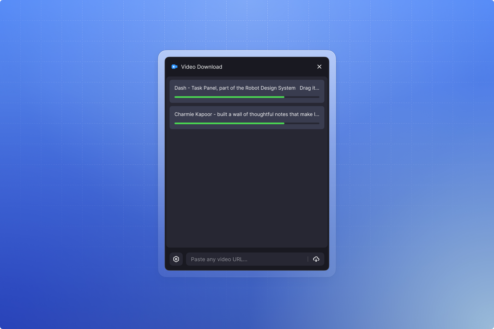

# Eagle Video Downloader

English | [中文](./README.md)

Download videos directly to Eagle from sites supported by yt-dlp. Built on [yt-dlp](https://github.com/yt-dlp/yt-dlp).

## Supported Platforms

YouTube, Twitter / X, TikTok, Bilibili, Instagram, Pinterest, Vimeo, and [many more](https://github.com/yt-dlp/yt-dlp/blob/master/supportedsites.md).

## Features

Supports sites backed by yt-dlp. Install yt-dlp via the dependency manager on first launch. Uses Eagle's official FFmpeg plugin for audio/video merging. Automatically imports downloaded videos to Eagle with metadata. Supports Chinese and English interfaces with real-time progress display. Also supports downloading image-only Pinterest Pins (fetches full-resolution originals automatically).

Chrome Cookie access is an optional feature, disabled by default. When enabled, if a download from any supported HTTPS URL fails, yt-dlp may read Chrome login cookies matching that site and send them directly to it. No developer or intermediary server is involved.

## Installation

Install via [Eagle Community](https://community-cn.eagle.cool/plugins) or search for it in Eagle's plugin center.

Manual install: download the [latest release](https://github.com/fansanqiu/eagle-video-downloader/releases), then in Eagle go to Plugins → Developer Options → Import Local Project.

## First Run

On first launch, install yt-dlp (~30MB) from the dependency management page. ffmpeg uses Eagle's official FFmpeg plugin — if missing, a button in the dependency manager allows one-click navigation to download it from the Eagle Store.

## Usage

1. Copy a video link
2. Paste it into the plugin input box
3. Click the download button
4. The video is automatically imported to Eagle after download

## Development

```bash
npm install      # Install dependencies
npm run build    # Build plugin
npm run dev      # Development mode (watch for changes)
npm run package  # Packaging Plugin
```

The project uses esbuild for bundling, i18next for internationalization, yt-dlp for video extraction, and Eagle's official FFmpeg plugin.

## System Requirements

Eagle 4.0 or higher. Eagle's official FFmpeg plugin required. Internet connection required.

## License

MIT © [fansanqiu](https://github.com/fansanqiu)

For personal use only. Please comply with the terms of service of video platforms and applicable copyright laws.

## Acknowledgements

This project is based on [OlivierEstevez/eagle-twitter-video-downloader](https://github.com/OlivierEstevez/eagle-twitter-video-downloader). Thanks to the original author for the foundational work. Video extraction is powered by [yt-dlp](https://github.com/yt-dlp/yt-dlp), and audio/video merging and transcoding are powered by [FFmpeg](https://ffmpeg.org).
