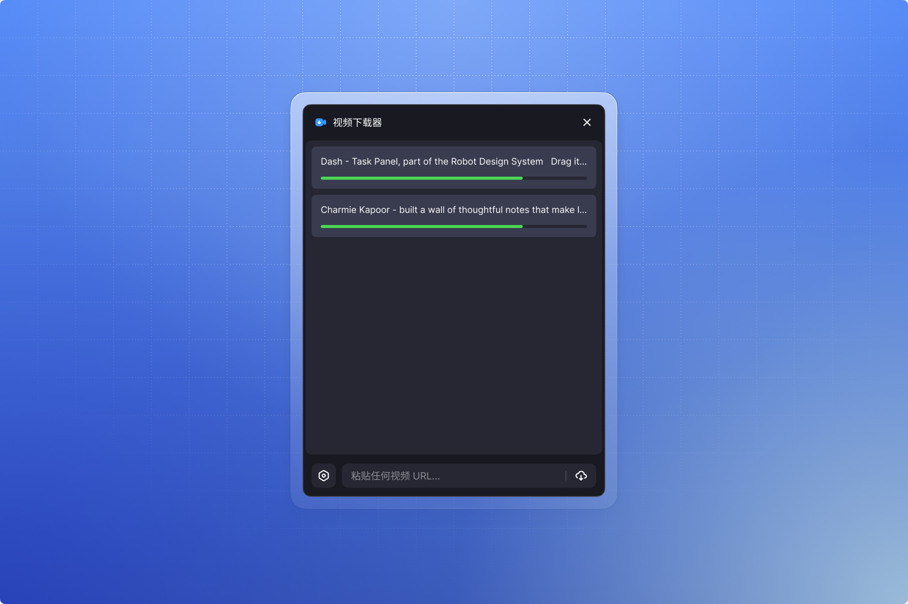

# Eagle Video Downloader

[English](./README.en.md) | 中文

从 yt-dlp 支持的网站直接下载视频到 Eagle。基于 [yt-dlp](https://github.com/yt-dlp/yt-dlp) 构建。

## 支持的平台

YouTube、Twitter / X、TikTok、Bilibili、Instagram、Pinterest、Vimeo 以及[更多平台](https://github.com/yt-dlp/yt-dlp/blob/master/supportedsites.md)。

## 功能特性

支持 yt-dlp 支持的视频网站，首次运行需要在依赖管理页点击安装 yt-dlp，使用 Eagle 官方 FFmpeg 插件合并音视频，下载完成后自动导入到 Eagle 并保存元数据，支持中英文界面，显示实时下载进度。同时支持下载 Pinterest 纯图片 Pin（自动获取高清原图）。

浏览器 Cookie 访问为可选功能，默认关闭。开启后，若某个受支持 HTTPS 链接下载失败，yt-dlp 可能读取 Chrome 中与目标网站匹配的登录 Cookie 并直接发送给该网站。不经开发者或任何中间服务器。

## 安装方式

通过 [Eagle 社区](https://community-cn.eagle.cool/plugins) 安装，或在 Eagle 应用的插件中心搜索安装。

手动安装：下载[最新版本](https://github.com/fansanqiu/eagle-video-downloader/releases)，在 Eagle 中选择 插件 → 开发者选项 → 导入本地项目。

## 首次运行

首次启动时需要在依赖管理页安装 yt-dlp（约 30MB）。ffmpeg 使用 Eagle 官方 FFmpeg 插件；若本地未安装，可在依赖页点击按钮一键跳转至 Eagle 应用商店下载。

## 使用方法

1. 复制视频链接
2. 粘贴到插件输入框
3. 点击下载按钮
4. 下载完成后自动导入到 Eagle

## 开发

```bash
npm install      # 安装依赖
npm run build    # 构建插件
npm run dev      # 开发模式（监听文件变化）
npm run package  # 打包插件
```

项目使用 esbuild 打包，i18next 国际化，yt-dlp 负责视频提取，ffmpeg 由 Eagle 官方 FFmpeg 插件提供。

## 系统要求

Eagle 4.0 或更高版本，需安装 Eagle 官方 FFmpeg 插件，需要网络连接。

## 开源协议

MIT © [fansanqiu](https://github.com/fansanqiu)

本工具仅供个人使用，请遵守视频平台的服务条款和版权法律。

## 致谢

本项目基于 [OlivierEstevez/eagle-twitter-video-downloader](https://github.com/OlivierEstevez/eagle-twitter-video-downloader) 开发，感谢原作者的开创性工作。视频解析与提取由 [yt-dlp](https://github.com/yt-dlp/yt-dlp) 提供支持，音视频合并与转码由 [FFmpeg](https://ffmpeg.org) 提供支持。
